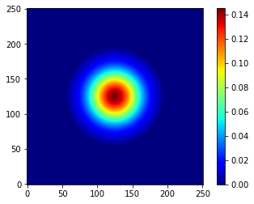
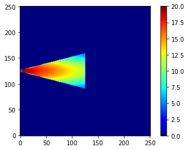
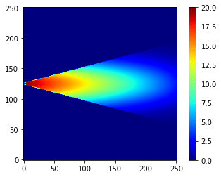
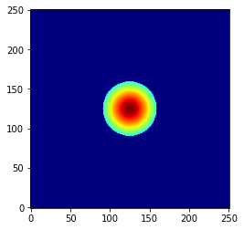
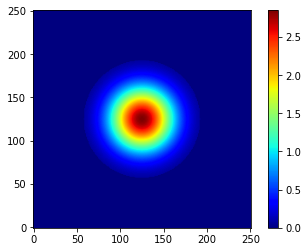

# dsp_cogh-simulation

# Model 1

## Sagittal plane:

### after 0.066 s , distance 1 m

### after 0.227 s , distance 2 m

 

## croronal plane:

### after 0.066 s  distance 1 m

### after 0.227 s , distance 2 m

 

# Model 2

## Sagittal plane:

### after 1.016 s , distance 1 m

### after 4 s , distance 2 m

 

## croronal plane:

### after 1.016 s  distance 1 m

### after 4 s , distance 2 m

 